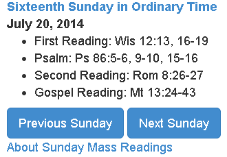

Sunday Mass Readings
============

Introduction
------------

SundayMassReadings is a Google Chrome extension which provides links to the Sunday mass readings on the USCCB website.

Download
-------
[Latest version] (https://github.com/joshpeterson/SundayMassReadings/blob/master/SundayMassReadingsExtension.crx?raw=true)

Versions
---------
Version 5:
* Fix the readings for December 30, 2012

Version 4:
* Add readings up to (and including) May 5, 2013

Version 3:
* Fix the link for the Seventh Sunday of Easter
* Fix the link for the Pentecost

Version 2:
* Add a link to the website on the Chrome Extensions page

Version 1:
* Initial release
* All Sunday mass readings for 2012

Dependencies
------------
SundayMassReadings depends on the following other software:

* [Datejs] (http://www.datejs.com) provides date processing in JavaScript.

* [BeautifulSoup] (http://www.crummy.com/software/BeautifulSoup) provides HTML parsing used to generate the list of Sunday Mass readings

License
-------
This software is licensed under the [MIT License] (http://www.opensource.org/licenses/mit-license.php).

This software is not affiliated with the USCCB.
